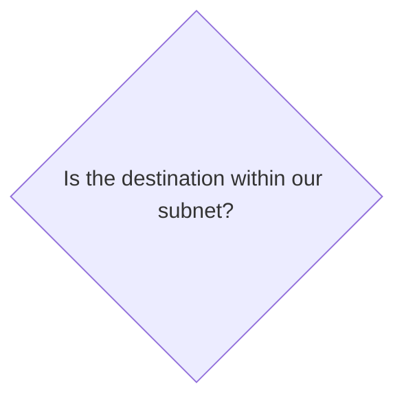

# Networking

- IPv4 vs IPv6

## Machine to Network

A network capable device (laptop, PC, NestHub) has one or more Network Interface Cards (NICs)

Each NIC is uniquely connected to a network.  A device can be connected to multiple networks. 

Each NIC has a unique Media Access Control Address (MAC) that uniquely identifies it from all other devices.  If you buy 60 HP laptops, they may all have Realtek wireless NICs, but each card will have a unique NIC.  Fun fact, since these aren't randomly generated, if ordered in bulk like this, the addresses may even be sequential!

Virtual Network Adapters are a thing - if you have installed a VMM (VirtualBox, Hyper-V, etc) your device also hosts a virtual network for it to connect to.

The NIC is what is actually given information about connecting to the network.

As far as what connects you to a network, there's options:
- Wifi (WLAN)
    - 2.4 GHz & 5 GHz are used most commonly
    - Check out the rules of [frequency ranges for wifi](https://en.wikipedia.org/wiki/List_of_WLAN_channels)
- CAT cable
    - general term for unshielded twisted pair
    - You can look further down this rabbit hole into all the [versions of CAT cables](https://www.guru99.com/ethernet-cables-types.html)
- [Coaxial Cable](https://en.wikipedia.org/wiki/Coaxial_cable)
- [Fiber-optic cable](https://en.wikipedia.org/wiki/Fiber-optic_cable)

## Connection to a Network

There are two sub-situations within this: 
- requesting network info
- manually configuring network info

In general, you need the following network information to be on a network (remember, this is per NIC):
- IP address
- Subnet mask
- Gateway address
- DNS address
- DHCP address (if applicable)
- lease time (if applicable)

You'll see Dynamic Host Control Protocol (DHCP) most commonly on private IPV4 networks or networks where there are specific sets of allowed devices.  [Check out this article for more details on DHCP](https://whatismyipaddress.com/dhcp).  On controlled networks, allowed MACs are collected, and only matching MACs will receive network information.  At school, or a library, or Starbucks, you might see disallowed MACs - MACs banned after generating worrisome network traffic.

## Connecting to a Domain / Hostname

Domain Name System (DNS) is the lookup system you rely on.  Instead of remembering IP addresses of everything you want to connect to, you use the hostname.  You are usually given a first lookup DNS, where a cache is kept of last seen IP to hostname correlations.  If it hasn't seen it, you are passed to the next up the chain until a full query is made (ie. you are the first to have looked up that hostname in your region).  [Check out the DNS flow](https://www.cloudflare.com/learning/dns/what-is-dns/)
- [Types of DNS Records](https://www.cloudflare.com/learning/dns/dns-records/) also matter.  You should familiarize yourself with:
    - A - holds IPv4 address of a domain
    - AAAA - holds the IPv6 address of a domain
    - CNAME - forwards one domain or subdomain to another domain, does NOT provide an IP address
    - MX - directs mail to an email server
- Once you get an IP address of the domain / hostname you are connecting to, you can address the packet to the correct destination.

The other part of this conversation is the **protocol** - this will define a slew of things such as the port to connect to and how communication needs to be formatted for the application to create and assemble packets.

Now, if we know who we are talking TO (the destination IP) and how to talk to them (protocol) and where the service is listening (the port), we just need to get there (well, our packets) and get a response.

