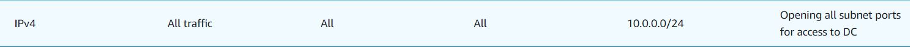
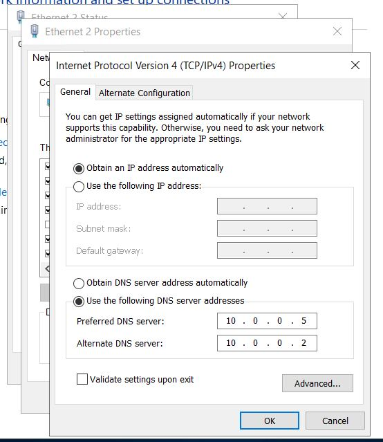
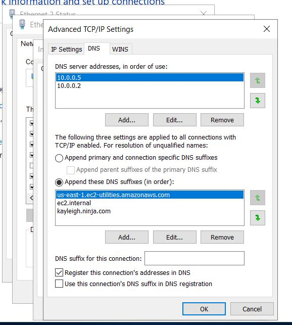
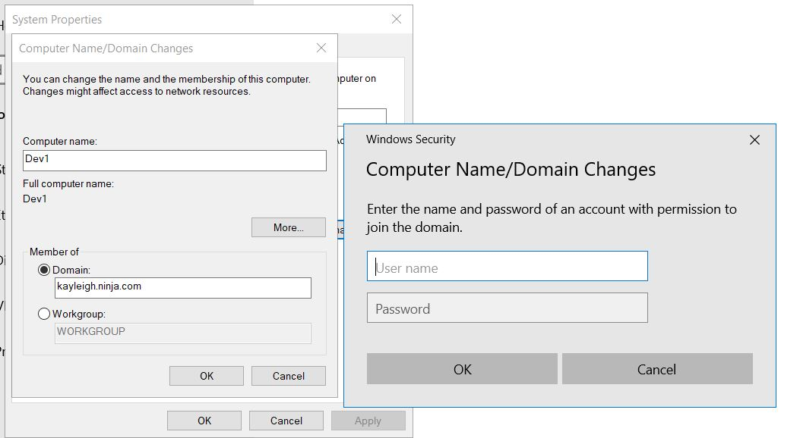

## How to join a PC to AD Domain

1. Security Group
Since we are hosting instances on a private subnet, open all traffic within the subnet.  
For me, this looks like:  

If you don't like all things open (and you shouldn't) create one rule for each port on the chart in this document: https://learn.microsoft.com/en-us/troubleshoot/windows-server/networking/service-overview-and-network-port-requirements

2. DNS - Phase 1

In your instance's Powershell, run `ipconfig /all` - confirm `10.0.0.2` is also your instance's default DNS IP.

In the network connection settings, select at minimum "Use the following DNS server addresses"
    - In Box 1, Enter your AD private IP (as it is also a DNS server)
    - In Box 2, Enter your instance's default DNS IP (so you can still get to Google and stuff by name)

For me, this looks like:  

3. DNS - Phase 2

Add your domain name as a DNS suffix name.  In the menu where you changed your IP settings to the DNS addresses above, click "Advanced", then go to "DNS" tab.  Add a DNS suffix of your domain name.

For me, this looks like:  

### Join Domain

Note: would change PC name first, reboot, then do join domain step.

For me, this looks like:  

### Troubleshooting

If it is setup right, the following commands should work.  If not, which ones work indicate what you forgot to set up.

- response indicates Security Groups / Firewalls are set
    - `ping 10.0.0.5` 
- response indicates DNS address is properly added
    - `ping domain.name`
    - `ping DCname.domain.name` 
    - `nslookup domain.name`
    - `nslookup DCname.domain.name`
- response indicates domain name added as DNS lookup
    - `nslookup DCname`