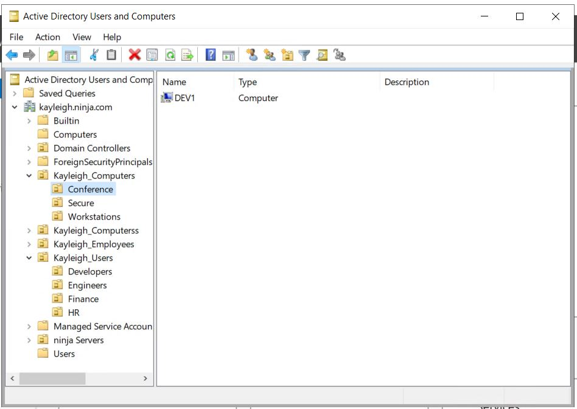

# Project 3 - Identity Management with Active Directory

- [Getting Started & Notes](#getting-started--notes)
- [Setup AD DC](#setup-ad-dc)
- [AD Structure](#ad-structure)
- [OUs & GPOs](#ous--gpos)
- [Submission](#submission)
- [Rubric](Rubric.md)

## Getting Started & Notes

Your project documentation will be in your course repository is a folder named `AD` in a file named `README.md`.  Include additional files, like `csv` and `ps1` files, in your `AD` folder.

### Accessing Windows Server Password:

- Go to EC2 menu
- Click on `Windows Server 2019` checkbox
- Click Details -> Security -> Get Windows password
- Paste the contents of your private key you've been using for your ubuntu system

### Installing VSCode for PowerShell on Windows Server 2019:

1. Check and install updates (I restarted after updates)
2. Open IE, enable **Downloads and Active Scripting** (https://docs.rackspace.com/support/how-to/enable-file-downloads-in-internet-explorer/)
3. Restart Internet Explorer
4. Download & Install Edge **for Windows Server 2019** (https://www.microsoft.com/en-us/edge)
5. Open Edge, download and install VSCode **System Installer** x64-bit (https://code.visualstudio.com/Download#)
6. Install git for Windows (https://git-scm.com/download/win)
7. Open VSCode, install PowerShell extension by Microsoft

## Setup AD DC

- Configuring a Windows Server to be a Domain Controller
  - Outline of basic steps and resource(s) referenced
- Domain Name:
- Domain Controller Name:
- Domain DNS IP:

## AD Structure

### Create OUs

Create the following Organizational Units - Provide screenshot proof:

- `[Domain] Computers` - client / user machines
  - `Conference` - publicly accessible kiosks and presentation devices
  - `Secure` - machines for HR and finance users
  - `Workstations` - machines for developers and engineers
- `[Domain] Servers` - servers for org (data shares, repo hosts, HPCs)
- `[Domain] Users`
  - `Finance` - can log on to Secure computers, managed by hr_finance_admins group
  - `HR` - can log on to Secure computers, managed by hr_finance_admins group
  - `Engineers` - can log on to Workstations, managed by dev_eng_admins
  - `Developers` - can log on to Workstations, managed by dev_eng_admins
 

**Extra Credit (5%)** Provide a scripted solution that generates the OUs in your domain. There is a sample `.csv` and `.ps1` script in this folder

### Joining Users

Using a PowerShell script, join the users in [users.csv](users.csv) to your domain. Make sure `domain User` is corrected to your `OU` name. The users need to be organized into the [Domain] Users OU and into their corresponding child OUs.  There is a sample `.ps1` script in this folder.

- Add csv file of users and PowerShell script to your repo.
- Screenshot that users are in correct OUs
  - one screenshot is sufficient, just need to see concept is accomplished

**Extra Credit (5%)** Provide a scripted solution to add users to the OUs given in the OU1 and OU2 column.  There is a sample `.csv` file in this folder

### Joining Computers

Create another Windows Server instance in AWS on your VPC. Write the steps needed to join the Windows Server to the Domain in the `[Domain] Computers` OU. Provide screenshot proof of success.

**Resources:**
  - https://adamtheautomator.com/add-computer-to-domain/
  - Don't forget that DNS step ;)

### Creating Groups

Create the following Security Groups and define where they should be within the OUs based on their roles:

- `project_repos_RW` - users who have Read / Write access to project repositories
- `finance_RW` - users who have Read / Write access to finance share
- `onboarding_R` - users who have Read access to onboarding documents
- `server_access` - users who can log on to Servers
- `dev_eng_admins` - IT admins to handle Developer and Engineer accounts
- `hr_finance_admins` - IT admins to handle HR and finance accounts
- `remote_workstation` - Group of workstations that allow RDP connections

## OUs & GPOs

### Applying Group Policies

Find guides to create the following Group Policy Objects and specify where they should be applied.

- Lock out Workstations after 15 minutes of inactivity.
- Prevent execution of programs on computers in Secure OU
- Disable Guest account login to computers in Secure OU
- Allow server_access to sign on to Servers
- Set Desktop background for Conference computers to company logo.
- Allow users in `remote_workstation` group to RDP to Workstations

**Extra Credit (5%)** Create and apply one of these policies, and show proof it worked.
  - The Windows Server you joined to the domain can serve as a good dummy here

### Managing OUs

More people are joining the IT/ administration side of things. Note: you can promote from within or create some new users

Join at least one person to the `hr_finance_admins` and `eng_dev_admins` groups, respectively. Delegate control of the OUs corresponding to the appropriate admin groups.

Document how to delegate control of an OU to a group, which OUs they now delegate, and what permissions they were given (and why you think the scope is appropriate)

**Resources**
- https://theitbros.com/active-directory-organizational-unit-ou/

## Submission

In the Pilot Dropbox, paste the URL to your folder
- URL should look like: https://github.com/WSU-kduncan/ceg2410s24-YOURGITHUBUSERNAME/blob/main/AD

Contents should include:
- `README.md`
- csv file(s)
- PowerShell script(s)
